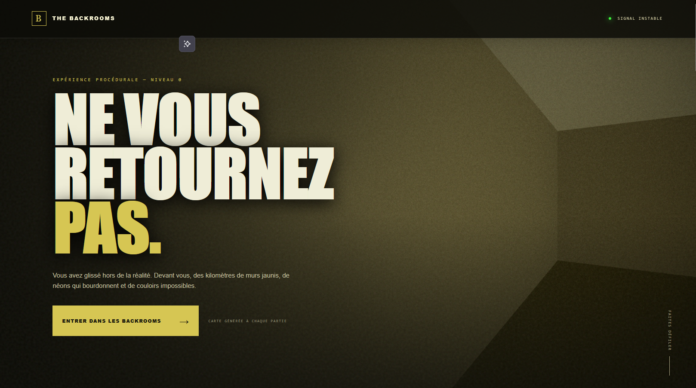

# The Backrooms

[](https://patobeur.github.io/backrooms/)

## Jouer en ligne

### [Entrer dans les Backrooms →](https://patobeur.github.io/backrooms/)

Un jeu d’exploration procédurale en vue subjective, plongé dans l’atmosphère inquiétante des Backrooms.

Les labyrinthes se construisent et s’enchaînent sans fin. Chaque partie renouvelle les couloirs, les salles, les objets et le chemin vers le prochain seuil.

## Le jeu

- Labyrinthes procéduraux continus
- Chargement dynamique des zones autour du joueur
- Ambiance sonore entièrement générée en JavaScript
- Inventaire 3D et interactions contextuelles
- Objets à récupérer, examiner, boire, déposer ou combiner
- Livres et messages cachés dans le niveau
- Gestion de la faim et de la soif
- Guide lumineux capable de montrer le chemin et de revenir chercher le joueur
- Artefacts laissés au passage entre les niveaux
- Présences furtives à partir des labyrinthes suivants
- Page d’accueil et panoramas générés localement

## Jouer

Cette édition est entièrement statique : aucun framework, serveur Node.js ou CDN n’est nécessaire sur l’hébergement.

Pour la tester en local :

```bash
python -m http.server 8000
```

Ouvrez ensuite :

```text
http://localhost:8000/
```

> Les modules JavaScript doivent être servis par HTTP. Un lancement direct avec `file://` peut être bloqué par le navigateur.

## Commandes

| Commande | Action |
|---|---|
| `ZQSD` / `WASD` | Se déplacer |
| Souris | Regarder |
| `Ctrl gauche` | Courir |
| `E` | Prendre un objet |
| `F` | Examiner |
| Maintenir `Tab` | Ouvrir l’inventaire 3D |
| Molette ou glissement | Sélectionner un objet |
| `R` | Boire |
| `G` | Déposer l’objet sélectionné |
| `C` | Combiner des objets compatibles |
| `H` | Activer un objet compatible |

Le menu radial indique automatiquement les actions disponibles sur l’objet visé ou sélectionné.

## Publication statique

Publiez directement l’ensemble des fichiers et dossiers présents à côté de ce README.

Pour une adresse telle que :

```text
https://patobeur.fr/patobeur/games/backrooms/
```

placez tout le contenu de ce dossier dans le répertoire correspondant sur le serveur. Tous les chemins sont relatifs : le jeu fonctionne donc également dans un sous-dossier.

## Structure du dépôt

```text
├── assets/                 Styles, icône et image sociale
├── canvas/                 Générateur visuel des panoramas
├── js/                     Jeu, accueil, audio et labyrinthes
├── vendor/                 Three.js embarqué localement
├── index.html              Page d’accueil et jeu
└── README.md
```

## Technologies

- HTML5 et CSS natif
- JavaScript ES Modules
- Three.js local et WebGL
- Web Audio API

## Compatibilité

Le jeu nécessite un navigateur récent prenant en charge WebGL, les modules JavaScript et la Web Audio API. Le son commence après la première interaction avec la page, conformément aux restrictions des navigateurs.

## Auteur

Créé par **Patobeur**.

Three.js est distribué selon sa propre licence.

---

> Ne restez pas immobile. Et si vous entendez autre chose que les néons… ne cherchez pas à comprendre.
